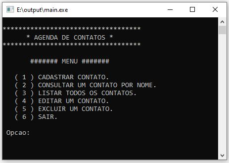
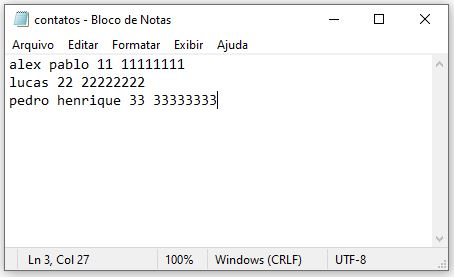

# Agenda de Contatos
Este é um simples programa em C para gerenciar uma agenda de contatos.

# Imagens de Demonstração

<p float="left">
  
  
</p>

# Funcionalidades

1. **Cadastrar Contato**
   - Permite cadastrar novos contatos com nome, DDD e número de telefone.
2. **Consultar Contato por Nome**
   - Facilita a busca por contatos através do nome. "pesquisa deve ser feita da forma que foi cadastrado"
3. **Listar Todos os Contatos**
   - Exibe todos os contatos cadastrados na agenda.
4. **Editar Contato**
   - Permite a edição de informações de um contato existente atravez do ID.
5. **Excluir Contato**
   - Remove um contato da agenda atravez do ID.
6. **Sair**
   - Encerra o programa.

# Compilação e Execução
Para compilar o programa, utilize um compilador C padrão, por exemplo:
1. **Compilar:**
   ```bash
   gcc main.c -o agenda
2. **executar:**
   ```bash
   ./agenda
Certifique-se de seguir esses passos na linha de comando do terminal para compilar e executar o programa corretamente. 

Se o problema persistir, verifique se o nome do arquivo (index.c) está correto e se o compilador está instalado corretamente em seu sistema.

# Observações
- Os contatos são armazenados no arquivo contatos.txt
- Para Funcionamento correto do codigo depois de compilado voce deve ter um arquivo '**contatos.txt**' no mesmo diretorio que o programa compilado.
- Os contatos não devem ser editado diretamente no arquivo txt.
- O código utiliza a biblioteca windows.h para a função Sleep, o que pode ser ajustado conforme o sistema operacional.

# Contribuições
Sinta-se à vontade para utilizar, modificar e contribuir para aprimorar este código, sinta-se à vontade para enviar um pull request. Fico feliz com sugestões e melhorias!

# Autor
Este programa foi criado por Alex Pablo.

Curso de Sistemas de Informação - UNEMAT.
